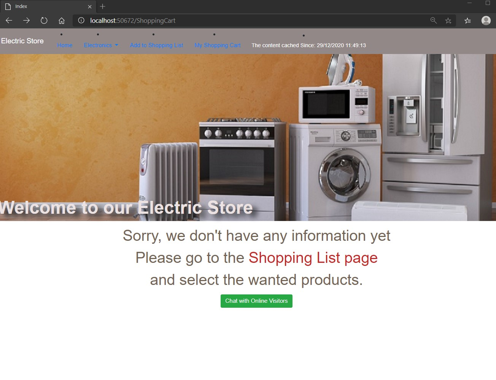
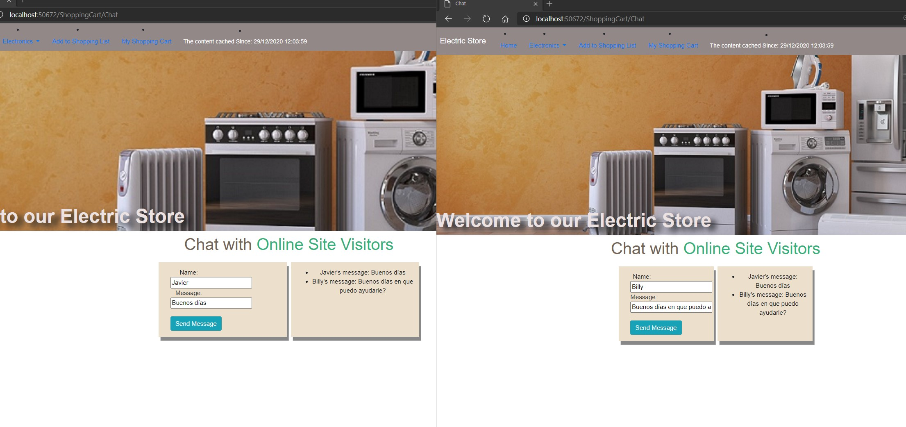

# Module 12: Performance and Communication

## Lab: Performance and Communication

1. **Nombres y apellidos:** Francisco Javier Moreno Quevedo
2. **Fecha:** 02/12/2020
3. **Resumen del Ejercicio:** implementar el uso de SignalR en el proyecto a traves de un chat
4. **Dificultad o problemas presentados y como se resolvieron:** Ninguna

Ejercicio 2: Managing State

- Creamos la clase **ChatHub**

- EN el middleware inyectamos el servicio

- En el Package.json incluimos la dependencia de SignalR

- En el **ShoppingCartController.cs** Creamos la acción Chat

- Creamos la vista de esta acción donde incluiremos dos campos de usuario y mensaje y un boton de enviar

- En la vista index.cshtml de ShoppingCart incluimos un boton de chat

- Creamos la carpeta js bajo wwwroot y añdimos el fichero  chat-hub.js

- Incluimos la referencia a ese Js en la vista del chat

- Ejecutamos y comprobamos que desde otra ventana recuperamos los productos comprados

  

